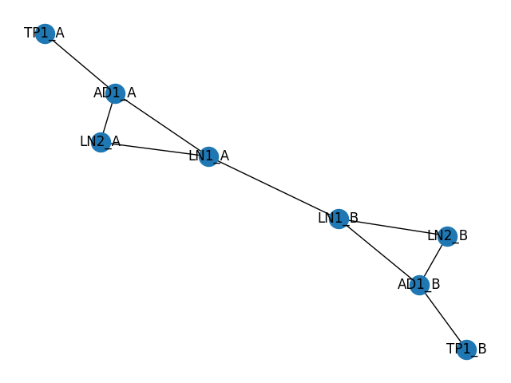
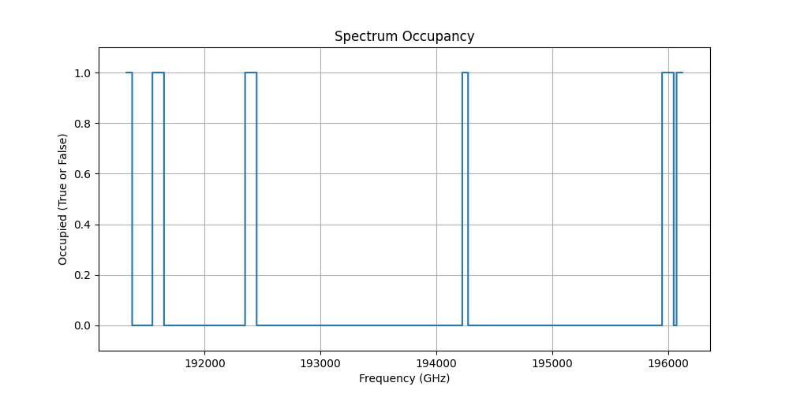

<div align="center">
    
</div>

<div align="center">
    <h2>CzechLight Software-Defined Network (SDN)</h2> 
</div>
The CzechLight SDN serves as a software-defined network planning and configuration tool designed specifically
for the CzechLight optical network.

### Prerequisites

To set up the environment, install the required dependencies using the following `pip` command::

```bash
pip install -r requirements.txt
```

### Code structure

At the core of this project is the `Network` class (`src/network.py`), which represents the entire network. This class
encapsulates all network devices and their interconnections. To create an instance of the network, utilize the following
Python code:

```python
from src.network import Network

net = Network()
```

Devices can then be added to the network using the `add_device` method. Before adding devices, it's important to
define the channels currently in use by these devices. The `Channel` class facilitates this process:

```python
from src.channel import Channel
from src.device import CzechLightLineDegree, CzechLightAddDrop, TerminalPoint

channel_1 = Channel(191_325_000, 191_375_000)  # 13.5
channel_2 = Channel(191_550_000, 191_650_000)  # 16 (100GHz)

# Create Line Degree example
ln = CzechLightLineDegree("LN")
ln.add_channels([channel_1, channel_2])

# Create Add Drop example
ad = CzechLightAddDrop("AD")
ad.add_channels([channel_1])

# Create Terminal Point example
tp = TerminalPoint("TP")

net.add_device(ln)
net.add_device(ad)
net.add_device(tp)
```

Additionally, the connections between devices need to be defined using the `add_bidi_link` method:

```python
net.add_bidi_link("LN", "E1", "AD", "E2")
```

With the network established, you can visualize it using the `net.draw()` method, which generates a simplified
undirected graph representation.

<div align="center">
    
</div>

The tool also supports finding the shortest path between two devices:

```python
path = net.find_shortest_path("LN", "AD")
```

The `path` variable holds a `Path` object containing a list of `DirectionalPorts` to traverse between the two devices
and back. Furthermore, it's possible to generate device configurations along this path:

```python
channel = Channel(195_975_000, 196_025_000)  # 60.0
config = path.generate_config(channel, "./output_dir")
```

This operation produces device configurations, saving them in the `./output_dir` directory.

> **NOTE**
> The `generate_config` method currently adds **null** power values to the configuration due to an absence of
> calculation
> methods. This aspect requires modification before sending configurations to devices.

For scenarios when channel selection is uncertain, the tool provides a means to visualize bandwidth usage along the path
through `path.visualize_occupancy()`:

<div align="center">
    
</div>

### Plan of work

- [x] Create new repository for the controller
- [x] Create a NetworkX graph representation of the network
- [x] Use the NetworkX library to create find the shortest path between two nodes
- [x] From the shortest path, create a graph of the devices for visualization
- [x] From the shortest path, create a simple configuration for the devices
- [x] From this internal representation, create YAML/JSON configuration for the devices
- [ ] Send the configuration via RESTCONF to the devices